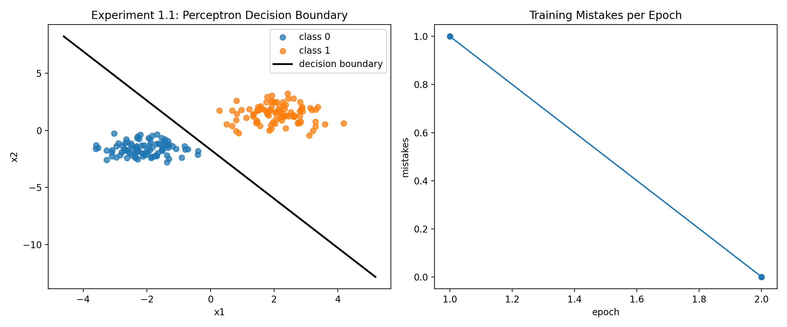

# 实验1.1 实验报告：线性分类器（感知机）实现

## 1. 基本信息
- 课程：人工智能
- 学生姓名：王李明
- 学号：2024302181194
- 实验章节：第1章
- 实验名称：实验1.1 线性分类器（感知机）实现
- 实验日期：2026-04-11

## 2. 实验目的
1. 理解线性分类模型的判别机制：$s = w^T x + b$。
2. 掌握感知机学习规则：$w \leftarrow w + \eta (y-\hat{y})x$，$b \leftarrow b + \eta (y-\hat{y})$。
3. 验证在线性可分数据上，误分类样本数会随训练迭代下降并收敛。
4. 通过可视化观察决策边界和训练误差变化。

## 3. 实验环境
- 操作系统：Windows
- Python 版本：3.10.19（Conda）
- 运行环境：D:\code\Python\ai_learn
- 主要库：
  - NumPy 2.3.5
  - Matplotlib 3.10.8
- 硬件：CPU（未使用 GPU）

## 4. 实验方法
### 4.1 模型结构
- 模型类型：二分类感知机（单层线性分类器）
- 输入维度：2
- 输出：类别标签 0 或 1

### 4.2 数据来源与预处理
- 数据为程序生成的二维 Toy Data。
- 使用两个高斯分布分别生成两类样本：
  - class 0 中心约为 (-2.0, -1.5)
  - class 1 中心约为 (2.0, 1.5)
- 每类样本数：120
- 总样本数：240
- 训练/测试划分：80% / 20%

### 4.3 训练配置
- epochs：50（支持提前停止）
- learning rate：0.01
- seed：42
- 终止条件：若某一轮误分类数为 0，则提前停止

### 4.4 关键实现步骤
1. 初始化权重与偏置（小随机权重 + 0偏置）。
2. 前向计算分数并进行阈值分类（score >= 0 判为 1）。
3. 对每个样本执行感知机更新规则。
4. 记录每轮误分类数 mistakes_history。
5. 训练完成后计算 train/test accuracy。
6. 可视化输出：
   - 左图：训练样本散点 + 决策边界
   - 右图：每轮误分类数曲线

## 5. 实验结果
### 5.1 核心日志（实测）
- epochs_run = 2
- final_epoch_mistakes = 0
- train_accuracy = 1.0000
- test_accuracy = 0.9583
- weights = [0.12733531, 0.0591298]
- bias = 0.1000

### 5.2 示例预测输出（节选）
- id=00, x=(-1.893, -0.982), score=-0.199, pred=0, target=0
- id=01, x=(2.069, 0.872), score=0.415, pred=1, target=1
- id=03, x=(3.463, 3.058), score=0.722, pred=1, target=1
- id=06, x=(-3.256, -1.865), score=-0.425, pred=0, target=0

### 5.3 可视化结果
- 图像内容说明：
  - 左侧决策边界可将大部分两类样本分开。
  - 右侧误分类曲线在第2轮降为0，说明训练快速收敛。



## 6. 结果分析
### 6.1 是否达到预期
达到预期。该实验的目标是在线性可分样本上验证感知机收敛性。结果显示仅训练2轮即达到训练集0误分类，且测试集准确率约95.83%，说明模型具备良好分类能力。

### 6.2 参数影响分析
1. 学习率（lr）：
   - 过小会导致收敛慢。
   - 过大会使更新震荡，在边界附近不稳定。
2. 样本分布重叠程度（scale）：
   - scale越大，类间重叠越明显，测试准确率通常下降。
3. 随机种子（seed）：
   - 会影响初始权重和样本顺序，导致收敛轮数与最终边界轻微变化。

### 6.3 误差与失败案例
测试集准确率不是100%，说明仍存在少量边界附近样本被误分。典型原因：
1. 两类高斯分布存在局部重叠。
2. 感知机是线性模型，无法处理非线性可分结构。

### 6.4 常见问题与调试
1. 维度不匹配：检查 x 与 w 的形状是否匹配。
2. 学习率不合适：出现不收敛或收敛过慢时，优先调 lr。
3. 数据切分异常：确认 test_ratio 不会导致训练集或测试集为空。
4. 可视化异常：决策边界绘制时注意 w[1] 接近 0 的分支处理。

## 7. 实验结论
本实验成功实现了基于 NumPy 的感知机二分类器，验证了在线性可分数据上感知机能够快速收敛。通过决策边界与误分类曲线的可视化，能够直观理解模型学习过程。该实验为后续多层网络和反向传播实验打下了实现与调参基础。

## 8. 附录
### 8.1 使用命令
```powershell
python 1.1_perceptron_linear_classifier.py
```

### 8.2 关键代码片段（感知机更新）
```python
for features, target in zip(x, y):
    pred = 1 if np.dot(features, self.weights) + self.bias >= 0.0 else 0
    update = lr * (target - pred)
    if update != 0.0:
        self.weights += update * features
        self.bias += update
```


