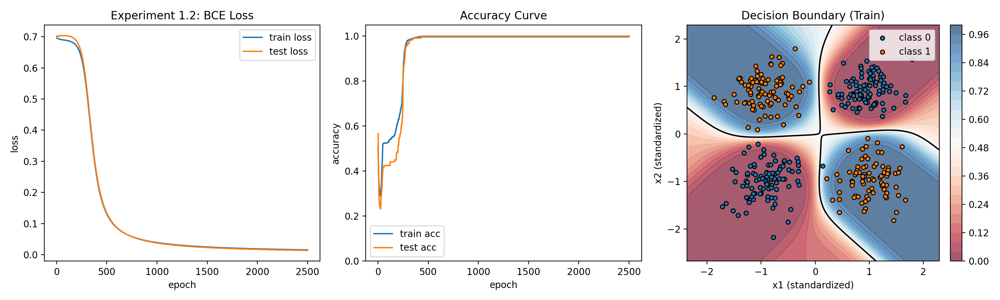

# 实验1.2 实验报告：三层神经网络与反向传播（Noisy XOR）

## 1. 基本信息
- 课程：人工智能
- 学生姓名：王李明
- 学号：2024302181194
- 实验章节：第1章
- 实验名称：实验1.2 三层神经网络与反向传播
- 实验日期：2026-04-11

## 2. 实验目的
1. 理解多层感知机（MLP）在非线性可分问题上的建模能力。
2. 掌握 sigmoid 激活与二元交叉熵（BCE）损失的组合。
3. 掌握反向传播中各层梯度的计算与参数更新。
4. 通过可视化观察损失、准确率与决策边界变化。

## 3. 实验环境
- 操作系统：Windows
- Python 版本：3.10.19（Conda）
- 运行环境：D:\code\Python\ai_learn
- 主要库：NumPy、Matplotlib
- 硬件：CPU（未使用 GPU）

## 4. 实验方法
### 4.1 模型结构
- 输入维度：2
- 隐藏层：8（sigmoid）
- 输出层：1（sigmoid，输出类别 1 的概率）
- 参数：w1, b1, w2, b2

### 4.2 数据来源与预处理
- 数据为程序生成的二维 Noisy XOR。
- 四个高斯簇中心：
  - (1, 1) -> 0
  - (1, -1) -> 1
  - (-1, 1) -> 1
  - (-1, -1) -> 0
- 每象限样本数：120
- 总样本数：480
- 训练/测试划分：75% / 25%（360 / 120）
- 预处理：使用训练集统计量对 train/test 进行标准化

### 4.3 训练配置
- epochs：2500
- learning rate：0.5
- hidden_dim：8
- noise：0.35
- log_every：250
- seed：42

### 4.4 关键实现步骤
1. 前向传播：x -> h -> y_hat。
2. 计算 BCE 损失。
3. 反向传播：
   - 输出层梯度：grad_logits = (y_hat - y) / batch_size
   - 反传到隐藏层并计算 w1/b1 梯度
4. 梯度下降更新参数。
5. 记录每轮 train/test loss 与 accuracy。
6. 输出图像：
   - 左图：train/test loss
   - 中图：train/test accuracy
   - 右图：训练集决策边界

## 5. 实验结果
### 5.1 核心日志（实测）
- epoch=1: train_loss=0.7015, train_acc=0.5139, test_loss=0.6950, test_acc=0.5667
- epoch=250: train_loss=0.6284, train_acc=0.8278, test_loss=0.6428, test_acc=0.8250
- epoch=500: train_loss=0.1308, train_acc=0.9972, test_loss=0.1337, test_acc=1.0000
- epoch=1000: train_loss=0.0388, train_acc=0.9972, test_loss=0.0376, test_acc=1.0000
- epoch=1500: train_loss=0.0247, train_acc=0.9972, test_loss=0.0230, test_acc=1.0000
- epoch=2000: train_loss=0.0188, train_acc=0.9972, test_loss=0.0171, test_acc=1.0000
- epoch=2500: train_loss=0.0153, train_acc=0.9972, test_loss=0.0138, test_acc=1.0000

### 5.2 最终指标（实测）
- train_size = 360
- test_size = 120
- final_train_loss = 0.015346
- final_test_loss = 0.013785
- final_train_accuracy = 0.9972
- final_test_accuracy = 1.0000

### 5.3 示例预测输出（节选）
- id=00, x=(-1.428, 1.105), proba=0.999, pred=1, target=1
- id=01, x=(0.919, -0.835), proba=0.997, pred=1, target=1
- id=06, x=(-0.518, -0.413), proba=0.065, pred=0, target=0
- id=07, x=(1.485, 0.997), proba=0.002, pred=0, target=0

### 5.4 可视化结果
- 图像说明：
  - loss 曲线稳定下降并收敛。
  - accuracy 在约 500 epoch 后接近饱和。
  - 决策边界呈明显非线性，可较好分割 XOR 结构。



## 6. 结果分析
### 6.1 是否达到预期
达到预期。Noisy XOR 是线性不可分问题，单层线性模型难以处理；三层网络可学习非线性边界，并在测试集达到 1.0000 准确率。

### 6.2 参数影响分析
1. hidden_dim：增大隐藏层容量通常有助于拟合复杂边界，但过大可能增加过拟合风险。
2. learning rate：当前 lr=0.5 收敛较快；若继续增大，可能导致训练震荡。
3. noise：噪声越大，类别重叠越明显，loss 下界会上升，准确率可能下降。
4. seed：会影响初始化与数据打乱顺序，导致收敛轨迹略有变化。

### 6.3 误差与失败案例
训练准确率略低于 1（0.9972）而测试为 1.0000，属于小样本切分下常见波动；主要误差通常发生在类边界附近高噪声样本。

### 6.4 常见问题与调试
1. loss 不下降：先检查学习率是否过大，或标准化是否正确。
2. 维度报错：检查 x、w1、w2、b1、b2 的形状匹配。
3. 指标异常：确认预测阈值与标签编码一致（0/1）。
4. 图像异常：确认输出目录可写且 matplotlib 可正常保存图片。

## 7. 实验结论
本实验成功实现了基于 NumPy 的三层神经网络与反向传播训练流程，并在 Noisy XOR 数据上学习到非线性决策边界。实验结果表明：相比线性模型，多层网络能够有效处理非线性可分任务。

## 8. 附录
### 8.1 使用命令
```powershell
python experiments/ch1/1.2_three_layer_neural_network_backprop.py
```

### 8.2 输出文件
- 图像：outputs/figures/ch1_exp1_2_mlp_backprop.png
- 日志：outputs/logs/ch1_exp1_2_metrics.csv
