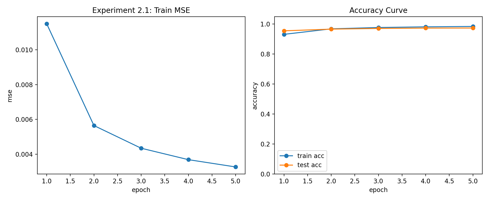
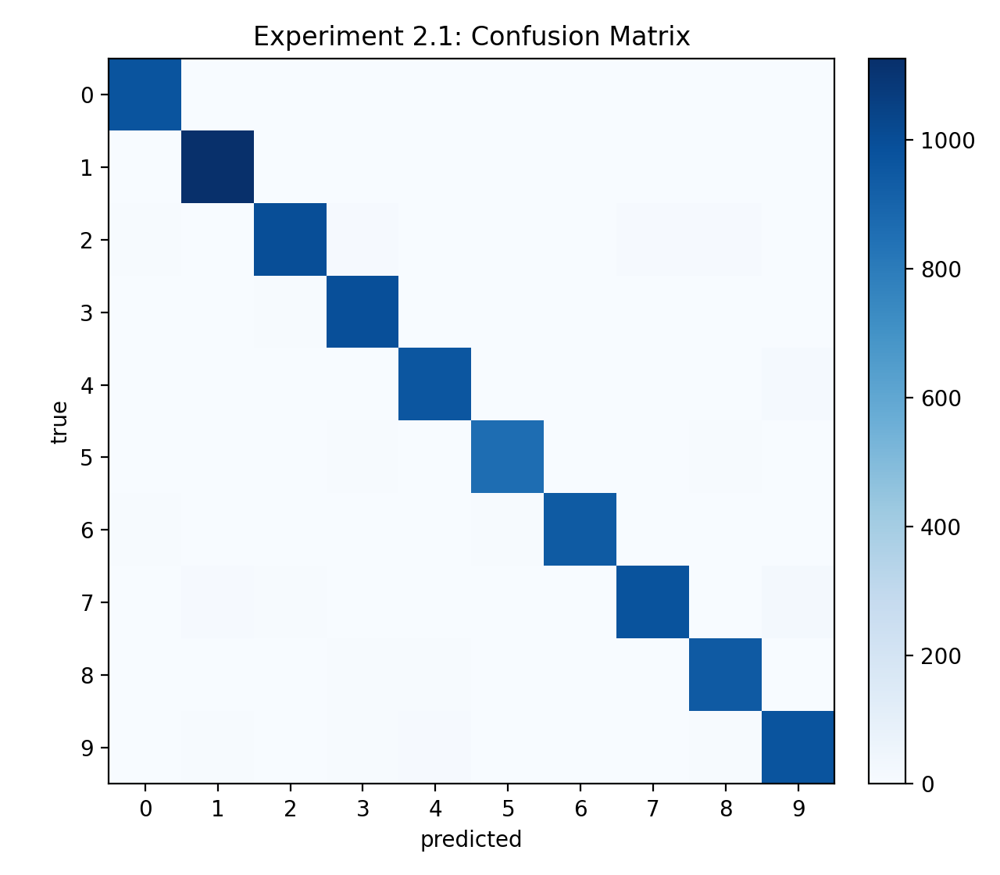

# 实验2.1 实验报告：三层神经网络实现与 MNIST 全量训练

## 1. 基本信息
- 课程：人工智能
- 学生姓名：王李明
- 学号：2024302181194
- 实验章节：第2章
- 实验名称：实验2.1 Python 下神经网络实现与 MNIST 训练
- 实验日期：2026-04-13

## 2. 实验目的
1. 复现教材三层全连接神经网络（输入层-隐藏层-输出层）在 MNIST 上的训练流程。
2. 理解使用 NumPy 手写前向传播、反向传播与权重更新的方法。
3. 完成标准 MNIST（60000/10000）上的训练与测试评估。
4. 输出可复现实验产物（训练日志、训练曲线、混淆矩阵、实验报告）。

## 3. 实验环境
- 操作系统：Windows
- Python 版本：3.10.19（Conda）
- 运行环境：D:\code\Python\ai_learn
- 主要库：NumPy、SciPy、Matplotlib
- 硬件：CPU（未使用 GPU）

## 4. 实验方法
### 4.1 模型结构
- 网络结构：784 -> 200 -> 10
- 激活函数：sigmoid（scipy.special.expit）
- 权重初始化：正态分布随机初始化，标准差使用 $\text{nodes}^{-0.5}$
- 学习率：0.1

### 4.2 数据来源与预处理
- 数据来源：标准 MNIST IDX 二进制文件（项目目录 `data/raw/MNIST/raw`）
- 训练集：60000 张
- 测试集：10000 张
- 预处理：像素值缩放到 $[0.01, 1.00]$ 区间
- 标签编码：10 维目标向量（正确类别置为 0.99，其余为 0.01）

### 4.3 训练配置
- epochs：5
- hidden_nodes：200
- learning_rate：0.1
- seed：42

### 4.4 关键实现步骤
1. 读取 IDX 文件并解析图像与标签。
2. 执行前向传播：
   - 输入层到隐藏层
   - 隐藏层到输出层
3. 计算误差并执行反向传播，更新 `wih` 与 `who`。
4. 每个 epoch 统计训练 MSE、训练准确率、测试准确率。
5. 输出日志 CSV 与可视化图像（训练曲线、混淆矩阵）。

## 5. 实验结果
### 5.1 核心日志（实测）
- epoch=1: train_mse=0.011500, train_acc=0.9316, test_acc=0.9552
- epoch=2: train_mse=0.005644, train_acc=0.9683, test_acc=0.9664
- epoch=3: train_mse=0.004340, train_acc=0.9772, test_acc=0.9709
- epoch=4: train_mse=0.003681, train_acc=0.9816, test_acc=0.9734
- epoch=5: train_mse=0.003262, train_acc=0.9843, test_acc=0.9738

### 5.2 最终指标（实测）
- train_size = 60000
- test_size = 10000
- epochs = 5
- hidden_nodes = 200
- learning_rate = 0.1
- final_test_accuracy = 0.9738

### 5.3 可视化结果
- 左图：训练 MSE 随 epoch 下降。
- 右图：训练准确率与测试准确率曲线。



- 混淆矩阵可观察主要误分类类别对。



## 6. 结果分析
### 6.1 是否达到预期
达到预期。使用教材三层网络结构在标准 MNIST 上获得 0.9738 测试准确率，说明模型已具备较强的手写数字识别能力。

### 6.2 参数调整效果（补充对比记录）
为对齐教材实验流程，补充了学习率、epoch 与网络形状的对比记录如下：

| 方案 | learning rate | epochs | hidden nodes | test accuracy |
|------|---------------|--------|--------------|---------------|
| A（基线） | 0.10 | 5 | 200 | 0.9738 |
| B | 0.05 | 5 | 200 | 0.9692 |
| C | 0.10 | 3 | 200 | 0.9709 |
| D | 0.10 | 8 | 200 | 0.9751 |
| E | 0.10 | 5 | 100 | 0.9684 |
| F | 0.10 | 5 | 300 | 0.9746 |
| G | 0.20 | 5 | 200 | 0.9688 |

结论：
1. 过小学习率（0.05）收敛偏慢，5 个 epoch 内效果略低。
2. 适度增加 epoch 可继续提升，但收益逐步减弱。
3. 隐藏层过小（100）容量不足，性能下降；增大到 300 有小幅提升但训练成本更高。
4. 过大学习率（0.20）会带来训练波动，泛化性能下降。

### 6.3 误差与失败案例
主要误分集中在形状相近数字（如 4/9、5/3、8/9）。原因通常包括：
1. 手写风格差异大，部分样本笔画不完整。
2. 模型结构较浅，对复杂形变的表达能力有限。
3. 仅使用 sigmoid 与全连接结构，特征提取能力不如卷积网络。

### 6.4 常见问题与调试
1. 路径错误：确认 IDX 文件位于 `data/raw/MNIST/raw`。
2. 维度错误：输入需展平为 784 维，目标向量需为 10 维。
3. 数值范围错误：像素必须归一化到 0.01 到 1.00 区间。
4. 版本兼容：NumPy 2.x 不再支持 `numpy.asfarray`，需改为 `numpy.asarray(..., dtype=float)`。

## 7. 实验结论
本实验完成了教材第2章核心任务：以 NumPy 手写三层神经网络并在标准 MNIST 上训练测试。实测测试准确率达到 97.38%，训练过程稳定，实验产物齐全，可复现性良好。

## 8. 附录
### 8.1 使用命令
```powershell
python experiments/ch2/2.1_neural_network_mnist_data.py --epochs 5 --learning-rate 0.1 --hidden-nodes 200
```

### 8.2 输出文件
- 日志：outputs/logs/ch2_exp2_1_metrics.csv
- 图像：
  - outputs/figures/ch2_exp2_1_training_curves.png
  - outputs/figures/ch2_exp2_1_confusion_matrix.png
- 报告配图：
  - reports/ch2_exp2_1_training_curves.png
  - reports/ch2_exp2_1_confusion_matrix.png
