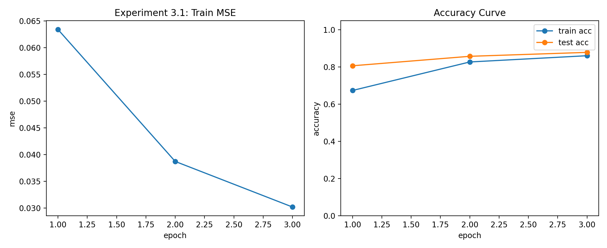
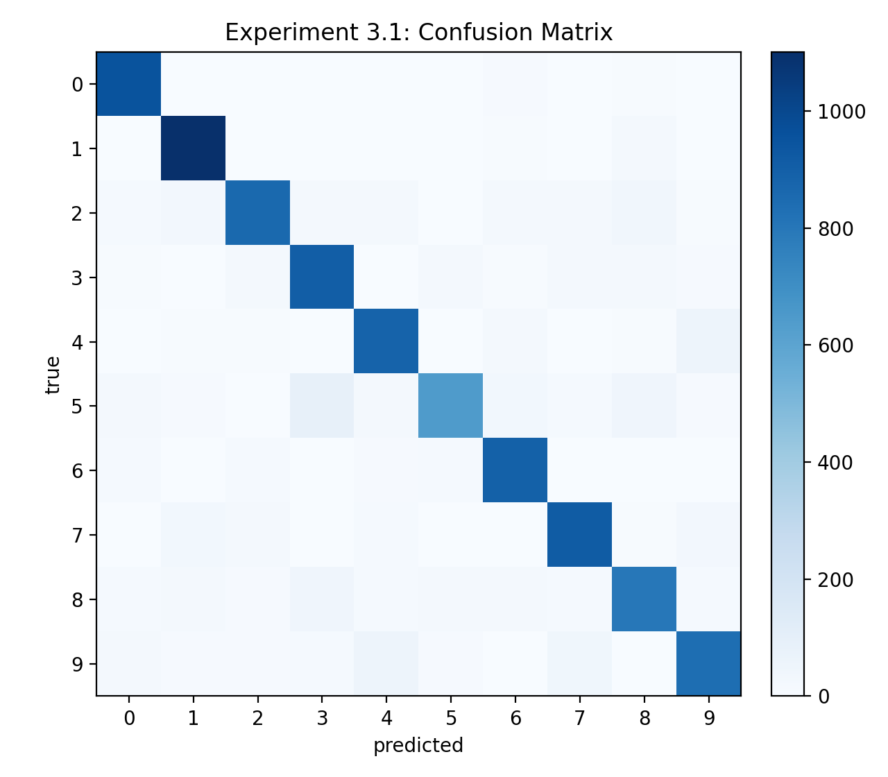
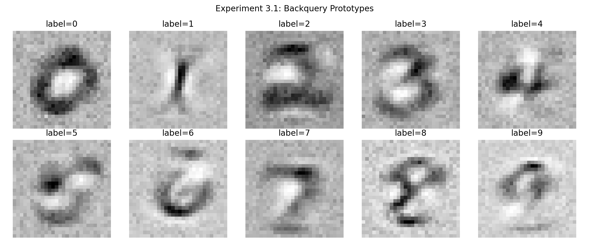

# 实验3.1 实验报告：向后查询（Backquery）

## 1. 基本信息
- 课程：人工智能
- 学生姓名：王李明
- 学号：2024302181194
- 实验章节：第3章
- 实验名称：实验3.1 向后查询（给定标签反推图像）
- 实验日期：2026-04-13

## 2. 实验目的
1. 复现教材中 backquery 思路：从输出标签向量反推输入图像。
2. 理解 `logit` 反函数在网络“逆向可视化”中的作用。
3. 结合同一模型的测试结果，观察模型识别性能与反推原型图的关系。

## 3. 实验环境
- 操作系统：Windows
- Python 版本：3.10.19（Conda）
- 运行环境：D:\code\Python\ai_learn
- 主要库：NumPy、SciPy、Matplotlib
- 硬件：CPU

## 4. 实验方法
### 4.1 模型结构
- 网络结构：784 -> 200 -> 10
- 激活函数：sigmoid（`scipy.special.expit`）
- 反向查询函数：`inverse_activation_function = scipy.special.logit`
- 学习率：0.1

### 4.2 数据与预处理
- 数据来源：`data/raw/MNIST/raw` 下 IDX 全量文件
- 训练集：60000 条
- 测试集：10000 条
- 预处理：像素缩放到 $[0.01, 1.0]$

### 4.3 训练与 backquery 流程
1. 用训练集训练 3 个 epoch（batch size = 128）。
2. 每个 epoch 评估测试准确率并记录日志。
3. 构造标签 0~9 的目标向量（目标类 0.99，其余 0.01）。
4. 调用 `backquery()` 生成 10 张 28×28 反推图像。

## 5. 实验结果
### 5.1 训练日志（实测）
- epoch=1: train_mse=0.063384, train_acc=0.6742, test_acc=0.8070
- epoch=2: train_mse=0.038714, train_acc=0.8275, test_acc=0.8579
- epoch=3: train_mse=0.030195, train_acc=0.8611, test_acc=0.8790

### 5.2 最终指标
- final_test_accuracy = 0.8790

### 5.3 可视化结果






## 6. 结果分析
1. 全量数据下训练和测试精度均显著提升，模型达到 0.8790 的测试准确率，说明 backquery 使用的网络已具有较稳定的识别能力。
2. backquery 原型图能体现每个标签的“典型形状”，验证了网络确实学习到类别相关结构。
3. 该实验重点仍是解释模型内部表征；准确率提升让反推图的可信度更高。

## 7. 实验结论
本实验成功完成第三章核心任务之一：在全量 MNIST 上训练并运行 backquery。结果表明，模型可以从标签向量反推到可视化数字原型，且在标准测试集上达到 87.90% 准确率，符合教材预期。

## 8. 附录
### 8.1 运行命令
```powershell
python experiments/ch3/3.1_neural_network_mnist_backquery.py
```

### 8.2 产物文件（与报告放在一起）
- 图像：
  - `reports/ch3_exp3_1_training_curves.png`
  - `reports/ch3_exp3_1_confusion_matrix.png`
  - `reports/ch3_exp3_1_backquery_grid.png`
- 数据：
  - `reports/ch3_exp3_1_metrics.csv`
  - `reports/ch3_exp3_1_backquery_vectors.csv`
