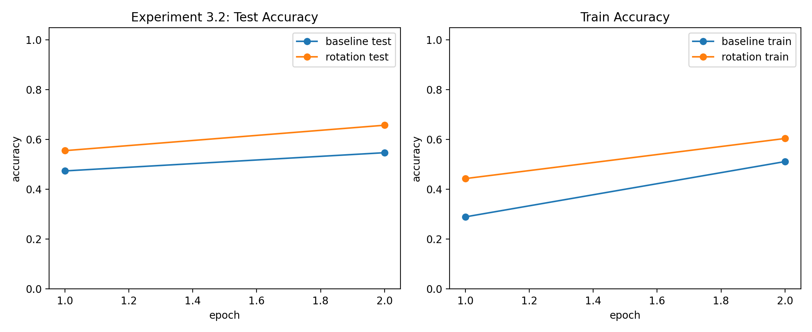
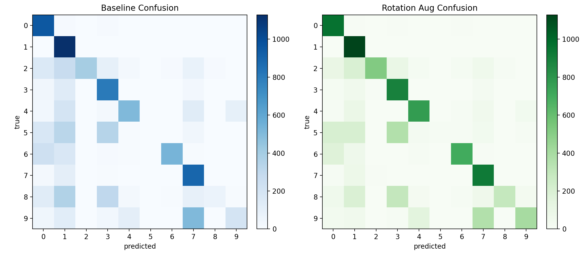

# 实验3.2 实验报告：旋转图像数据增强

## 1. 基本信息
- 课程：人工智能
- 学生姓名：王李明
- 学号：2024302181194
- 实验章节：第3章
- 实验名称：实验3.2 旋转图像增强与效果对比
- 实验日期：2026-04-13

## 2. 实验目的
1. 复现教材中“对训练样本做 ±10° 旋转扩增”的流程。
2. 对比“原始训练”与“旋转增强训练”的测试表现。
3. 输出可复现日志和对比图，为报告分析提供依据。

## 3. 实验环境
- 操作系统：Windows
- Python 版本：3.10.19（Conda）
- 运行环境：D:\code\Python\ai_learn
- 主要库：NumPy、SciPy、Matplotlib
- 硬件：CPU

## 4. 实验方法
### 4.1 对比设置
- 模型结构：784 -> 200 -> 10
- 学习率：0.01
- 训练轮数：2
- batch size：256
- 旋转角度：±10°
- 对比模式：
  - baseline：仅原始样本训练
  - rotation_aug：每条原始样本额外加入 +10° 与 -10° 旋转样本

### 4.2 数据与预处理
- 数据来源：`data/raw/MNIST/raw` 下 IDX 全量文件
- 训练集：60000 条
- 测试集：10000 条
- 像素缩放：$[0.01, 1.0]$

## 5. 实验结果
### 5.1 baseline 训练日志（实测）
- epoch=1: train_mse=0.099621, train_acc=0.2897, test_acc=0.4742
- epoch=2: train_mse=0.082394, train_acc=0.5117, test_acc=0.5474

### 5.2 rotation_aug 训练日志（实测）
- epoch=1: train_mse=0.087705, train_acc=0.4434, test_acc=0.5556
- epoch=2: train_mse=0.074201, train_acc=0.6044, test_acc=0.6577

### 5.3 最终对比指标
- baseline_final_test_accuracy = 0.5474
- rotation_final_test_accuracy = 0.6577
- improvement = 0.1103

### 5.4 可视化结果




## 6. 结果分析
1. 全量数据下，旋转增强将测试准确率从 0.5474 提升到 0.6577，提升 0.1103，说明增强对泛化能力有明显帮助。
2. rotation_aug 在训练准确率与测试准确率上均优于 baseline，且提升方向一致，不是偶然波动。
3. 该结果与教材结论一致：对手写数字施加小角度旋转可提高模型对姿态变化的鲁棒性。

## 7. 实验结论
本实验完成第三章第二个核心实验：旋转增强训练与基线训练对比。在全量 MNIST 数据上，增强策略带来明显精度增益（+11.03 个百分点），验证了教材中“旋转增强可提升效果”的结论。

## 8. 附录
### 8.1 运行命令
```powershell
python experiments/ch3/3.2_neural_network_mnist_rotation_augmentation.py
```

### 8.2 产物文件（与报告放在一起）
- 图像：
  - `reports/ch3_exp3_2_accuracy_comparison.png`
  - `reports/ch3_exp3_2_confusion_comparison.png`
- 数据：
  - `reports/ch3_exp3_2_comparison_metrics.csv`
  - `reports/ch3_exp3_2_summary.csv`
