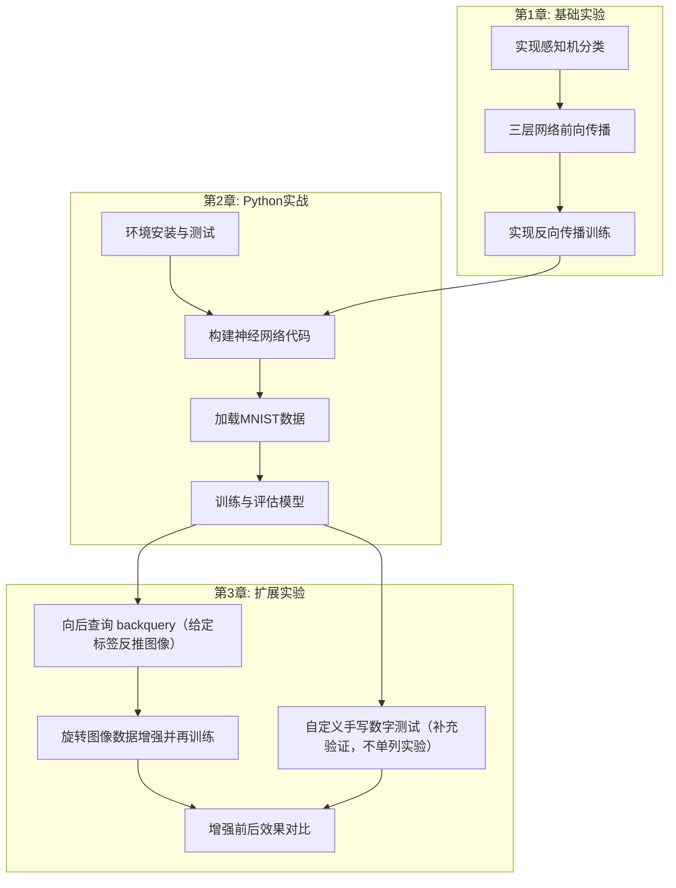

# 执行摘要

本报告基于《Python神经网络编程》教材（塔里克·拉希德著）前三章内容，概述了每章的实验任务与代码实现要求。第1章聚焦神经网络基础原理，包括线性模型、感知机、多层网络与反向传播等；第2章指导读者在Python环境下搭建并训练神经网络模型，重点是使用NumPy/Python实现网络并应用于手写数字识别（MNIST数据集）；第3章按教材主线的核心实验有两项：向后查询（backquery，给定标签反推图像）与旋转图像数据增强；“自写数字测试”更适合作为补充验证，不单列实验号。每章实验均要求提交完整代码与实验报告，代码需完成功能并展示运行结果。报告应涵盖实验目的、方法、结果示例与评估等要点。以下内容按章节分别给出详细分析，包括实验名称、目的、关键函数、输入输出、示例结果、评估指标、常见问题及报告要点；并给出环境依赖、任务清单、可能的章节主题替代方案、实现方式比较表格与流程图。

## 第1章 实验任务清单

**实验1.1：线性分类器（感知机）实现**  
- **目的**：理解线性模型与感知机概念，验证简单线性关系即可完成的分类任务。  
- **代码模块与关键函数**：使用纯Python或NumPy，实现感知机（Perceptron）或线性回归分类器；主要函数包括`predict(x,w,b)`计算输出，`train()`根据梯度下降/感知机规则更新权重。  
- **输入输出**：输入简单的二维或三维数值向量（如距离、特征等），输出类别标签（如0/1）或连续预测值。可使用Toy数据（如距离转换、简单逻辑问题）来检验；输出为分类结果或预测值。  
- **运行结果示例**：训练后输出如“输入 `[x,y]` → 预测类别=0（或1）”，并打印权重和阈值变化；若用回归方式，可输出拟合直线图。  
- **评估指标与验证方法**：分类任务使用准确率（Accuracy）或决策边界正确性；回归任务可用均方误差（MSE）验证。验证方法可对比手工计算结果或使用多组输入交叉验证。  
- **常见错误与调试**：常见维度不匹配（数据和权重维度）、学习率选取不当导致收敛缓慢或发散；分类边界不收敛（未迭代够次数）。调试时检查矩阵/向量乘法形状、输出阈值函数（如sigmoid/step）是否正确实现。  
- **实验报告要点**：应包括实验目的、算法原理（如感知机学习规则）、代码结构说明、参数设置、结果（例如训练误差曲线或分类结果表）、分析讨论（如参数影响、收敛情况）和总结。报告格式可按“目的→方法→结果→分析→结论”组织，并附训练过程图示或示例输出截图。

**实验1.2：三层神经网络示例与反向传播**  
- **目的**：掌握多层神经网络前向传播与反向传播更新原理，理解矩阵运算在网络中的应用。  
- **代码模块与关键函数**：使用NumPy实现一个包含输入层、单隐层和输出层的三层全连接神经网络；关键函数包括`forward(X)`进行矩阵前向传播，`backward(X,y)`进行误差反向传播和梯度计算（参照链式法则）；以及`update_weights()`更新权重。可采用sigmoid或ReLU激活。  
- **输入输出**：输入为向量或矩阵数据，可选用简化数据集（如0-1分类、异或逻辑或手工生成的样本），输出为对应的类别概率或数值；例如输入二维数据点输出二分类结果。  
- **运行结果示例**：训练完成后，输出网络对训练样本的预测结果（如与实际标签对比），打印最终权重矩阵数值；还可给出训练误差随迭代下降的折线图。  
- **评估指标与验证方法**：主要使用分类准确率（Accuracy）或交叉熵损失下降趋势；也可计算均方误差(MSE)。验证方法包括用测试集预测并与真实标签比对、使用不同超参数重复实验。  
- **常见错误与调试**：反向传播实现错误（梯度计算符号或维度错误）会导致权重未正确更新，检查链式求导推导；过小学习率导致训练缓慢，过大导致梯度发散；未归一化数据会影响收敛。调试建议逐步验证前向输出、反向梯度数值（可用数值梯度检查）。  
- **实验报告要点**：报告应描述神经网络结构、前后传播公式、关键代码逻辑、训练参数（学习率、迭代次数）、结果图表及分析。格式示例：模型定义、训练过程、结果展示（如混淆矩阵或准确率表）、误差分析、调试过程记录等。

### 第1章依赖环境

- **Python 版本**：推荐使用 Python 3.6以上（书中示例基于Python 3.5）。  
- **主要库**：NumPy（处理矩阵运算和向量化）、Matplotlib（可视化结果）、scikit-learn（可选的模型检验工具）。如需快速实现可选PyTorch或TensorFlow：PyTorch 1.x，TensorFlow 2.x（框架免去手动梯度计算，详见实现方式比较表格）。  
- **开发环境**：建议使用Jupyter Notebook或IPython交互环境（参见第2章）；可能使用Anaconda管理依赖。

## 第2章 实验任务清单（仅保留实验2.1）

**实验2.1：Python下神经网络实现与MNIST训练**  
- **目的**：使用Python搭建神经网络并在MNIST手写数字集上训练，巩固多层网络编程。  
- **代码模块与关键函数**：可以采用纯NumPy或深度学习框架实现（如PyTorch、TensorFlow/Keras）。关键包括数据加载（`load_data()`），模型定义（自定义函数或`torch.nn`/`tf.keras`层），训练循环（前向、计算损失、反向更新）。  
- **输入输出**：输入为MNIST图像数据（28×28灰度像素），输出为数字0–9的分类结果。预期输出为网络对测试集的预测标签。  
- **运行结果示例**：训练完成后输出如“Epoch n: loss=…, accuracy=…”，并最终打印测试集准确率，如约**90%~98%**（取决于模型复杂度）；可展示几张原图及其预测标签。  
- **评估指标与验证方法**：主要使用分类准确率（Accuracy）作为评估指标；也可计算混淆矩阵、召回率等。验证时使用训练/测试集分离评估；若用多个工具实现，可交叉验证结果。  
- **常见错误与调试**：MNIST数据加载格式错误（需注意像素范围归一化与标签编码）、模型未收敛（检查学习率、迭代次数、批量大小），过拟合（可通过增大数据或正则化改进）。注意张量维度变化（28×28要Flatten成784×1等）。  
- **实验报告要点**：描述网络结构（层数、激活函数、损失函数）、训练参数、结果表（准确率、损失变化）和示例预测图。报告应包括训练曲线图、性能评估、与预期专家模型对比（简要说明）以及代码片段说明（可列出核心训练循环或框架搭建示例）。

### 第2章依赖环境

- **Python库**：除第1章所列库外，本章涉及数据处理与网络实现，建议安装Pandas（可选，用于数据处理演示）、PIL或OpenCV（用于图像操作）。  
- **深度学习框架**：若采用高阶框架，可选TensorFlow 2.x/Keras或PyTorch 1.x。TensorFlow适合生产部署但相对较复杂；PyTorch语法更直观，适合研究与实验。  
- **数据集相关**：MNIST数据集，可通过常用接口（如`torchvision.datasets`或`tensorflow.keras.datasets`）下载；无需额外购买，确保网络连接或使用镜像加速下载。  

## 第3章 实验任务清单（2个核心实验 + 1个补充验证）

**补充验证：自定义手写数字识别（不单列实验）**  
- **作用定位**：用于验证第2章模型在“非MNIST原始测试集”上的泛化效果，属于演示性补充，而非第三章核心实验。  
- **对应 notebook**：`part3_load_own_images.ipynb`、`part3_neural_network_mnist_and_own_single_image.ipynb`、`part3_neural_network_mnist_and_own_data.ipynb`。  
- **核心处理**：灰度化、28×28、像素反相、缩放到0.01~1.0后调用`query()`。  
- **报告建议**：可作为“补充小节”写2~5个样本结果与误差原因，不单独占一个实验编号。

**实验3.1：向后查询（Backquery：给定标签反推图像）**  
- **目的**：理解网络“认为某个数字应长什么样”，即从输出端反推到输入端，帮助解释模型内部表示。  
- **对应 notebook**：`part3_neural_network_mnist_backquery.ipynb`。  
- **代码模块与关键函数**：在网络类中增加`inverse_activation_function = scipy.special.logit`与`backquery(targets_list)`；流程为输出层反函数→隐藏层→输入层，并在各层做归一化。  
- **输入输出**：输入为目标标签对应的目标向量（如某一类设为0.99，其余0.01），输出为28×28反推图像。  
- **运行结果示例**：对标签0~9分别反推，可看到每类数字的“原型图像”。  
- **评估指标与验证方法**：该实验以解释性结果为主，不以分类准确率为唯一指标；可结合同一 notebook 的测试准确率一起报告。  
- **常见错误与调试**：`logit`输入必须在(0,1)区间内；若归一化处理不当可能出现数值不稳定或图像对比度异常。  
- **实验报告要点**：建议把“目标向量设置、反推公式、反推图像解释”作为主体，强调这是第三章理论理解的关键环节。

**实验3.2：图像旋转数据增强实验（提升训练效果）**  
- **目的**：通过旋转扩充训练样本，提高模型对手写姿态变化的鲁棒性与测试表现。  
- **对应 notebook**：`part3_mnist_data_set_with_rotations.ipynb`（旋转演示）与`part3_neural_network_mnist_data_with_rotations.ipynb`（训练与评估）。  
- **代码模块与关键函数**：使用`scipy.ndimage.rotate`生成±10°样本，在原样本训练后追加旋转样本继续训练。  
- **输入输出**：输入为MNIST训练样本及旋转角度，输出为增强样本、训练过程与测试集性能。  
- **运行结果示例**：展示原图/旋转图，并对比增强前后准确率（或错误率）。  
- **评估指标与验证方法**：使用同一测试集对比增强前后性能；可增加“对倾斜数字样本”的专项对比。  
- **常见错误与调试**：旋转后边缘裁剪、插值导致模糊、增强比例过高引入分布偏移。  
- **实验报告要点**：明确“增强策略→训练流程→性能对比”的因果链，给出结论与改进建议（角度范围、增强比例等）。

### 第3章依赖环境

- **图像处理库**：Pillow（PIL）或OpenCV，用于图像旋转与预处理。  
- **绘图库**：Matplotlib，用于展示自写数字输入、backquery反推图和旋转结果。  
- **神经网络框架**：本书第三章示例可继续沿用NumPy实现；若重构为框架版也可使用TensorFlow/PyTorch。  
- **硬件环境**：第三章示例在CPU上可完成；仅在扩大数据量或增加对比实验时再考虑GPU。  

## 实验任务清单与优先级

根据实现难度和依赖关系，将各项任务按顺序排列并估计时间成本如下：  

| 任务编号 | 任务名称                         | 依赖           | 难度  | 预计时间（小时） |
|----------|----------------------------------|---------------|------|------------------|
| 1        | 环境搭建与库安装                 | 无            | 容易  | 2               |
| 2        | 实现简单线性分类器（感知机）     | 1             | 容易  | 2               |
| 3        | 实现三层神经网络前向传播         | 2             | 中等  | 2               |
| 4        | 实现反向传播算法并训练网络       | 3             | 较难  | 4               |
| 5        | MNIST数据加载与预处理           | 1             | 容易  | 1               |
| 6        | 使用Python实现神经网络训练MNIST  | 5             | 中等  | 3               |
| 7        | 补充验证：自定义手写数字测试（不单列实验） | 6      | 容易  | 1.5             |
| 8        | 核心实验：向后查询（给定标签反推图像）     | 6      | 中等  | 2               |
| 9        | 核心实验：旋转图像增强并再训练             | 5,6    | 中等  | 3               |
| 10       | 实验报告撰写与总结               | 所有任务       | 容易  | 3               |

### 任务说明

- **任务1**：先搭建Python环境，安装所需库（NumPy、Matplotlib等），确保代码执行环境准备完毕。最高。  
- **任务2-4**（第1章任务）：依次实现线性分类器、三层网络前向传播和反向传播。实现顺序不可颠倒（反向传播需先有前向实现）。调试和验证在每步完成后进行。  
- **任务5-6**（第2章任务）：加载MNIST数据后，使用选定的库实现网络训练。建议先用已有网络结构（完成任务4）做测试，然后重用代码训练MNIST。  
- **任务7-9**（第3章任务）：任务7仅作补充验证，不单列实验号；核心实验按“任务8 向后查询（重点理解）→任务9 旋转增强（性能提升）”执行。  
- **任务10**：汇总全部实验结果、截图和分析，撰写报告，并校对代码运行情况。  

## 其他可能的章节主题及实验方案

若教材章节内容与上述不同，下列为3–5种常见神经网络基础主题及相应实验思路示例：

- **感知器与线性分类实验**：实验名称如“感知器模型实现与训练”。*要点*：介绍二分类感知器，任务是使用NumPy从零实现一个感知器算法；*代码*：核心为权重向量更新函数`w ← w + η*(y - ŷ)*x`；*伪代码*：
  ``` 
  初始化w, b
  对每个训练样本(x, y):
      ŷ = sign(w·x + b)
      w += η*(y-ŷ)*x; b += η*(y-ŷ)
  ```
  目的验证若两类线性可分，误分类率逐渐减小。*输入输出*：如二维点集；*结果示例*：输出收敛后的分割直线参数并绘图。  
- **多层感知器与反向传播实验**：实验名称如“手写数字识别的多层神经网络”。*要点*：用两层隐含层的全连接网络对MNIST分类；*代码*：使用Python+NumPy或TensorFlow搭建，明确`forward`、`compute_loss`、`backward`函数；*伪代码*：
  ```
  def forward(X):
      h = sigmoid(X·W1 + b1)
      y = softmax(h·W2 + b2)
      return y
  def backward(X, y_true):
      Compute output loss, propagate gradient to W2,b2, W1,b1
      update weights
  ```
  *输入输出*：MNIST图像；*结果示例*：训练准确率提升过程图。  
- **卷积神经网络（CNN）基础实验**：实验名称如“简单CNN实现与训练”。*要点*：说明卷积层和池化层作用，任务是用TensorFlow或PyTorch构建一个包含卷积和池化的CNN（如LeNet-5结构），在MNIST上训练；*伪代码*：
  ```
  model = Conv2D→ReLU→MaxPool→Conv2D→ReLU→MaxPool→Flatten→Dense→Softmax
  model.compile(optimizer, loss, metrics)
  model.fit(train_images, train_labels, epochs, batch_size)
  ```
  *输入输出*：MNIST图像；*结果示例*：CNN在测试集上的分类准确率及几个卷积核可视化。  
- **循环神经网络（RNN）基础实验**：实验名称如“循环神经网络实现时间序列预测”。*要点*：介绍循环单元（RNN/LSTM）的反馈特性，实验任务为使用一个简单RNN对序列数据（如正弦波或文本字符）进行预测或分类；*伪代码*：
  ```
  for t in sequence:
      h_t = tanh(W_x·x_t + W_h·h_{t-1} + b)
      y_t = softmax(W_y·h_t + c)
  compute loss over sequence, backward propagate through time
  ```
  *输入输出*：序列输入，输出预测或序列标签；*结果示例*：展示RNN在训练数据上的拟合序列图。  
- **自动编码器实验**：实验名称如“无监督学习：自动编码器”。*要点*：讲述编码器-解码器结构，用于降维与重建。实验任务为实现一个简单的自编码器（全连接或卷积）在MNIST上重建输入；*伪代码*：
  ```
  encoder: h = relu(X·W1 + b1)
  decoder: X' = sigmoid(h·W2 + b2)
  loss = MSE(X, X')
  ```
  *输入输出*：输入为原始图像，输出为重建图像；*结果示例*：展示输入图和重建图的对比图像。  

以上主题仅为可能的拓展，实际实现时重点在于掌握网络结构搭建和前后传播算法。针对每种主题，都应列出关键步骤与伪代码，如网络层次结构、前向后向传播公式等。

## 实现方式比较：TensorFlow vs PyTorch vs 纯NumPy

| 实现方式        | 优点                                                         | 缺点                                                         | 适用场景                                    | 代码复杂度（示例）         |
|---------------|------------------------------------------------------------|------------------------------------------------------------|-------------------------------------------|--------------------------|
| **TensorFlow**| 官方支持度高，可部署生产环境；支持静态计算图和自动微分；社区资源丰富。<br>GPU加速性能好。 | 相对复杂，学习曲线陡峭；早期版本需显式构建计算图，调试不够直观。 | 大规模分布式训练、复杂模型开发和生产部署；需要高度优化时。   | 代码较多（需定义图和Session），若用TF 2.x/Keras接口简化代码。 |
| **PyTorch**  | 语法灵活，动态图机制直观易调试；社区活跃、文档好；与Python原生更贴近；易于研究与快速原型开发。 | 在产业应用中较TensorFlow起步晚（TensorBoard等工具不如TF完善）；老版本可序列化部署受限（PyTorch 1.x已改进）。 | 研究和教学环境、原型试验、需要频繁修改模型结构时。         | 代码简洁（直接定义模型、使用自动求导）。         |
| **纯NumPy**   | 对学习者友好，可深入理解神经网络内部计算；无额外依赖。             | 无自动微分支持，需手动推导实现反向传播；无GPU加速，计算效率低；易陷入细节，不适合复杂模型。 | 教学演示、验证算法逻辑、处理小规模数据；适合对原理学习和原型测试。 | 代码量大（需手写前向和后向），计算效率低。    |

其中，TensorFlow和PyTorch均提供自动微分和GPU支持，适合现代深度学习开发；其区别如上所示。纯NumPy则只能实现小型网络，更多用于教学和基础验证。实际项目中可根据需求选择：快速原型推荐PyTorch，工业级部署或与Google生态整合可选TensorFlow，学习算法原理可用NumPy。

## 实验流程图（章节与实验依赖关系）



该流程图展示了从基础到拓展的依赖关系：第1章中依次实现感知机、三层网络与反向传播；第2章先搭建环境后构建网络并训练MNIST；第3章在训练模型基础上，以向后查询与旋转增强为核心实验，自写数字测试仅作为补充验证。

**主要参考资料：** 来自《Python神经网络编程》官方资讯与章节目录，以及相关教程文献（反向传播原理、主流框架比较、MNIST数据集介绍等）。上述分析在未发现教材实验原文说明时，结合常见课程内容进行了合理推测和补充。
